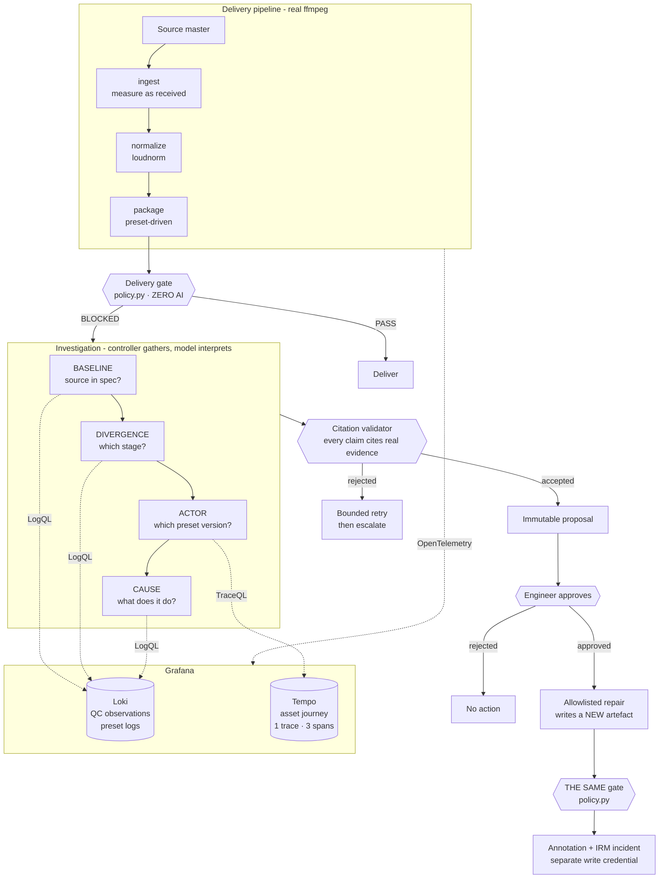
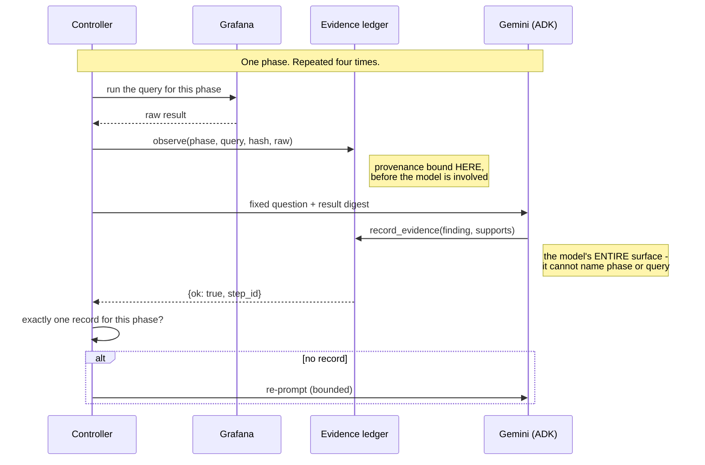

# Architecture

## The one rule everything follows

> **The model plans, hypothesises and tests. Deterministic code executes every
> query, mints the provenance for what actually ran, adjudicates the result, and
> holds the only key to any action.**

This used to read *"the model interprets and proposes; deterministic code
gathers"* - and that was accurate, which was the problem. The investigation was
four hardcoded queries and the model described the results, two of them from a
dict that already contained the answer. `--reasoner scripted` scored the same
with no AI at all, so the model was not load-bearing.

The model now chooses its tools, decides when it has enough, and can run an
experiment to test a hypothesis. **Not one boundary moved to allow that.**

Every boundary below exists to keep that true under adversarial conditions -
including an adversarial *model*. The design assumes the model may be wrong,
confidently wrong, or actively trying to overstep, and arranges for none of those
to matter.

---

## Trust boundaries

Things the model can never do, enforced structurally rather than by
prompting:

| The model cannot… | Enforced by |
|---|---|
| Decide whether an asset is compliant | `pipeline/policy.py` - zero AI, pure function, called to block *and* to clear |
| Claim it ran a query it did not run | The controller executes every tool and mints the `step_id` inside `after_tool_callback`, **before the result reaches the model**. An id it did not cause to exist is an id it cannot obtain. |
| Attribute a failure to a preset it did not test | `conclude` refuses an attribution with no experiment in the ledger. A preset that ran is not a preset that caused. |
| Rest a measured claim on evidence that is not the measurement | `CLAIM_SOURCES` binds each claim type to the evidence that can support it. Without it, "I measured +6.1 LU" citing a preset lookup validates cleanly with no experiment run. |
| See a Grafana tool that writes | Its toolbox is a six-tool read-only allowlist out of the MCP server's 74. The write path is a separate module with a separate credential. |
| Execute anything | Three allowlisted action ids; `pipeline/remediation.py` re-validates before running; execution authority is IAM on the worker |

Prompting is not a boundary. Neither is tool filtering. **Credentials are** - the
investigation runs read-only, and the write path is a separate module with a
separate token.

---

## System



The loop closing back on **the same gate** is the point. If the agent's
attribution were wrong, the repair would not clear - the conclusion is
falsifiable rather than merely plausible.

---

## The investigation, step by step



**Why the controller re-checks.** ADK's `SequentialAgent` guarantees sub-agents
run in order. It does not guarantee a tool was called, that the expected query
was used, or that any evidence exists. Without a controller-side check, a phase
can silently complete having recorded nothing.

**Why the tool never raises.** ADK converts an exception inside a tool into an
*aborted invocation*, not a retryable response. Validation failures return
`{"ok": false, "error": …}` so the model can see and correct them.

---

## Why retrieval is deterministic

Only ACTOR and CAUSE involve genuine judgement. "Fetch the ingest QC line for
this run" is a lookup, and "which stage first went out of spec" is a comparison -
dressing either up as agentic reasoning would be theatre, and four sequential
model calls would make the demo glacial.

The queries are still *derived*: `gather_actor(failing_stage)` cannot be written
until DIVERGENCE returns a stage. They are templates parameterised by prior
results, and the controller records exactly which query ran.

---

## Signal routing

| Signal | Store | Why |
|---|---|---|
| Per-asset QC observations, preset logs | **Loki** | QC results are *test records*, not operational time-series |
| Asset journey - one trace, three spans, preset version per span | **Tempo** | This is what makes ACTOR attribution load-bearing rather than decorative |
| Aggregate pipeline health | *(omitted)* | Three backends because three exist would be decorative |

Pushing per-measurement values into Prometheus keyed by `asset_id` is a
cardinality anti-pattern. Two rules make correlation actually work:

1. **Every log line carries `trace_id` and `span_id`.** Without them the traces
   and the logs are two disconnected piles and there is no investigation to run.
2. **Label cardinality is deliberate.** `stage`, `preset_id`, `preset_version`
   are low-cardinality resource attributes. `run_id` and `asset_id` stay in the
   body.

### The trace is the hero view

```
delivery.run                                    ← one root per asset
 ├─ stage.ingest       preset=ingest_passthrough_v1 v1
 ├─ stage.normalize    preset=norm_ebu_v3           v3   changed 2026-08-14
 └─ stage.package      preset=pkg_h264_v7           v7   changed 2026-08-29T14:02Z
```

Getting this wrong is silent: if stage spans are not children of the run span,
Tempo shows three unrelated single-span traces instead of the asset's journey,
and the one view nothing else produces disappears.
`tests/test_telemetry.py` guards it.

---

## Module responsibilities

```
pipeline/
  ffmpeg.py       every subprocess call - argument building, errors, +faststart
  qc.py           measurement ONLY. Never decides.
  policy.py       the gate. ZERO AI. Pure function. Called twice per incident.
  stages.py       ingest → normalize → package, preset-driven
  presets.yaml    versioned presets with changed_at. FAULTS LIVE HERE.
  profiles/       the authority on pass/fail - the file, not the code
  remediation.py  re-validates, then executes; writes a NEW artefact
  telemetry.py    OTel emission; no-ops entirely without an endpoint

agent/
  grafana.py      READ-only Loki/Tempo via the datasource proxy
  annotations.py  WRITE side. Separate module, separate credential.
  investigator.py the fixed four-phase topology
  evidence.py     ledger, structured claims, citation validator, allowlist
  reasoner.py     the model-facing surface: record_evidence(finding, supports)
  conclusion.py   claim assembly + deterministic adversarial candidates

server/
  orchestrator.py run state machine; approval is a separate request
  app.py          FastAPI + SSE
ui/               Next.js 15 · Tailwind 4 · TanStack Query/Table
```

---

## Faults are configuration

```yaml
package:
  - id: pkg_h264_v6
    default: true
    audio_filter: "anull"          # stereo passthrough
  - id: pkg_h264_v7
    changed_at: "2026-08-29T14:02:00Z"
    audio_filter: "pan=stereo|c0=c0+c1|c1=c0+c1"
```

Injection is `overrides={"package": "pkg_h264_v7"}` - ordinary preset selection.
There is no `if asset_id == "demo_001"` anywhere, which is the first thing a
reviewer greps for.

---

## Approval is not an agent pause

The investigation runs to completion and stops at an **immutable proposal**.
Approval arrives as a separate HTTP request and is matched against that proposal.

Suspending an agent mid-run and resuming it across a stateless boundary is real
distributed-systems work - durable state, idempotency, stale-approval handling -
and buys nothing a user can see. The proposal-plus-separate-approval shape is
equivalent from the outside and has no resumable session to get wrong.

---

## Deployment

ADK runs **in-process** rather than on a managed agent runtime, which lets the
MCP/Grafana client and the ffmpeg worker share a filesystem and a process. The
alternative splits media across object storage and adds an authenticated hop for
every tool call - real work that changes nothing a reviewer can observe.

Agent logic is kept host-agnostic, so the serving layer can change without
touching the investigation.

**Local vs Grafana Cloud is not an environment-variable swap.** `otel-lgtm`
provisions datasource UIDs `loki` / `tempo`; Grafana Cloud generates
stack-specific ones such as `grafanacloud-<stack>-logs`. UIDs are configuration
(`GRAFANA_LOKI_UID`, `GRAFANA_TEMPO_UID`) precisely because of this.

---

## Failure modes and what happens

| Failure | Behaviour |
|---|---|
| Source arrived out of spec | Escalate. **No repair proposed** - re-encoding would mask a supplier problem |
| Nothing is wrong | No investigation, no action |
| Model records no evidence | Bounded controller-side retry, then escalate |
| Model cites evidence that does not exist | Conclusion rejected by the validator |
| Model proposes an off-allowlist action | Refused before execution |
| Repair does not fix it | The same gate says BLOCKED again |
| Telemetry not yet queryable | Bounded poll - ingestion is eventually consistent and per-signal |
| Grafana IRM unavailable | Annotation still written; incident degrades to a clear skip |

---

## What this architecture does not do

- **Verify that the reasoning is sound.** Schema validity proves *shape*, not
  *entailment*. "A supporting step exists" is not "that step supports this claim."
- **Prove causation.** A preset changing before a failure is correlation. The
  conclusion is hedged, and its weight comes from what the preset *does*.
- **Cover the real delivery spec.** Three stages stand in for nine; two checks
  stand in for dozens. Audio channel mapping and caption conformance cause far
  more real rejections than loudness.
